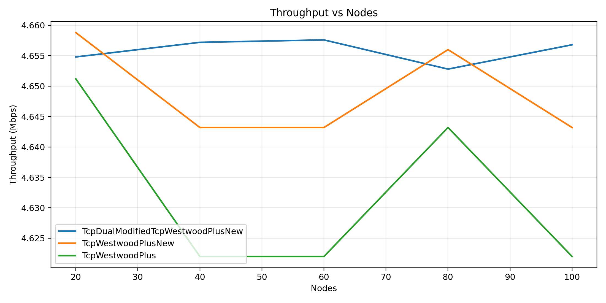

# TCP Westwood+ Modification · NS-3
> Congestion control improvements targeting throughput and packet loss reduction in wired network simulations.

---

## What this project is

Modified the **TCP Westwood+** congestion control algorithm, targeting improve throughput and reduce packet loss.

Detailed documentation is available in:

* `Overview and findings/Project Overview.pdf` ()
* `Overview and findings/Findings-Report.pdf`  (!)

---

## Core Modifications

All custom congestion control logic lives in:

```
src/internet/model/tcp-dual-modified-tcp-westwoodplus-new.cc
```

## Key Changes

> **Bandwidth-ratio based congestion window** — Window size governed by `CalculateBWRatio`, tying `cwnd` directly to observed bandwidth ratios.

> **Adaptive congestion avoidance** — Three-mode behavior:
> - Faster growth when bandwidth improves
> - Normal additive increase under stable load
> - Proportional decay when bandwidth drops

> **Smoothed RTT-based adaptive RTO** — Retransmission timeout estimated via `UpdateRtoEstimate` using smoothed RTT signals.

> **Link-recovery signaling** — Recovery events triggered based on RTT ratio thresholds for fast path restoration detection.


### Key changes include:
- **Bandwidth-ratio based congestion window** behavior (`CalculateBWRatio`).
- **Adaptive congestion avoidance**:
  - Faster growth when bandwidth improves.
  - Normal additive increase under stable load.
  - Proportional decay when bandwidth drops.
- **Smoothed RTT-based** adaptive RTO estimation (`UpdateRtoEstimate`).
- Link-recovery signaling based on **RTT ratio thresholds**.
  

## Throughput vs. Nodes



---

## Wired OAT Experiments

One-At-a-Time (OAT) experiments vary a single parameter while holding all others fixed.

### Parameter Space

| Parameter | Values |
|---|---|
| Nodes | 20, 40, 60, 80, 100 |
| Flows | 10, 20, 30, 40, 50 |
| Packet Rate (pps) | 100, 200, 300, 400, 500 |

### Execution Modes

| Mode | Configurations | Variants | Total Runs |
|---|---|---|---|
| Sanity | 1 | 3 | 3 |
| Full OAT | 13 | 3 | 39 |

The **40-second wired time-series** setup compares three variants head-to-head:

- `TcpWestwoodPlus`
- `TcpWestwoodPlusNew`
- `TcpDualModifiedTcpWestwoodPlusNew`

---

## Running Simulations

All commands are run from the project root.

### 1. Wired OAT — Sanity Run

```bash
python3 scripts/run_wired_oat.py \
  --mode sanity \
  --run-tag wired_sanity \
  --simulation-time 20 \
  --sampling-interval 2 \
  --enable-cwnd
```

### 2. Wired OAT — Full Run

```bash
python3 scripts/run_wired_oat.py \
  --mode full-oat \
  --run-tag wired_oat_full \
  --simulation-time 20 \
  --sampling-interval 5
```

### 3. Plot Wired OAT Results

```bash
python3 scripts/plot_wired_oat.py --run-tag wired_oat_full --mode full-oat
python3 scripts/plot_wired_oat.py --run-tag wired_oat_full --mode requested
```

### 4. 40-Second Time-Series Run and Plots

```bash
./ns3 run "wired-time-series-40s --simulationTime=40"

python3 scripts/plot_wired_time40.py
python3 scripts/plot_wired_time40_focus.py
python3 scripts/plot_wired_time40_three.py
```

---

## Output Locations

| Type | Path |
|---|---|
| OAT data | `data/wired_oat/<run-tag>/` |
| Time-series data | `data/wired_time40/` |
| OAT plots | `plots/wired_oat/<run-tag>/` |
| OAT requested plots | `plots/wired_oat_requested/<run-tag>/` |
| Time-series plots | `plots/wired_time40/` |
